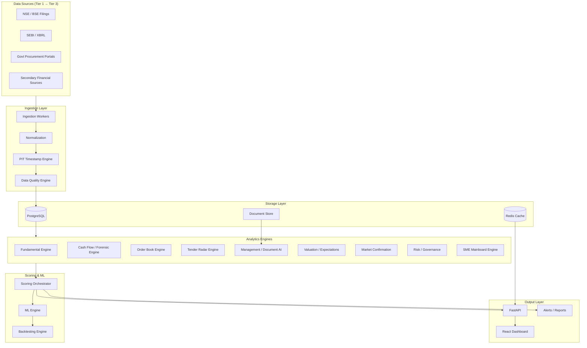
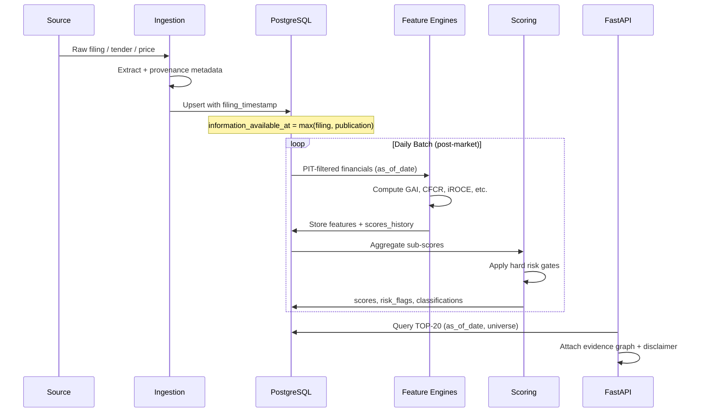
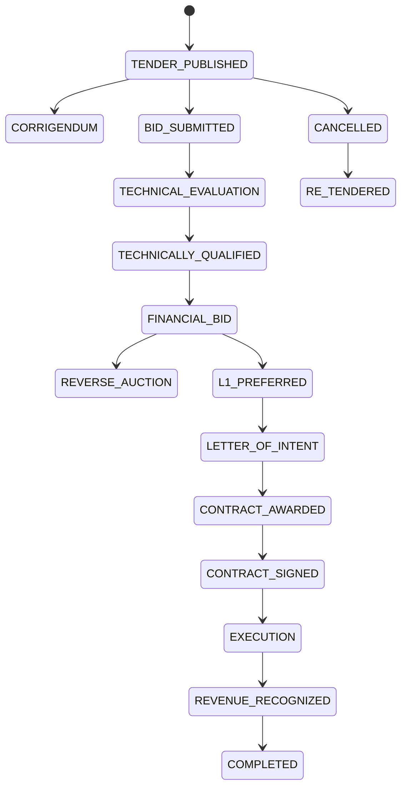
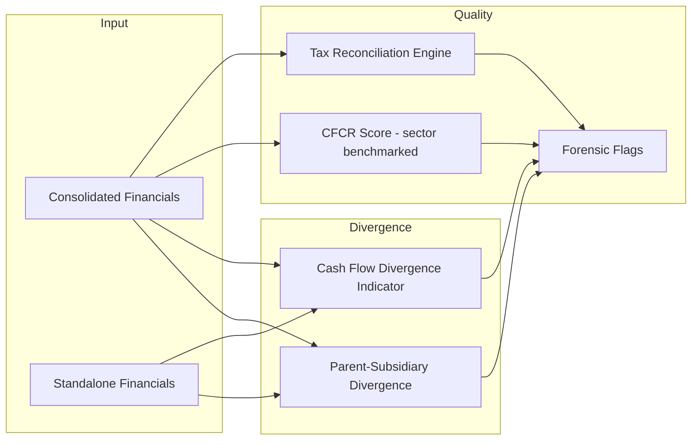
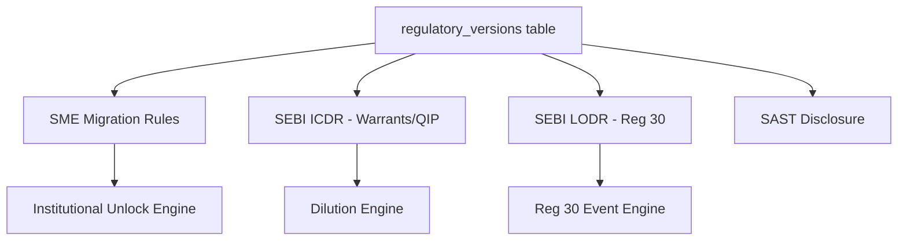
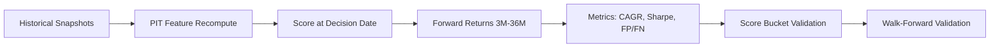
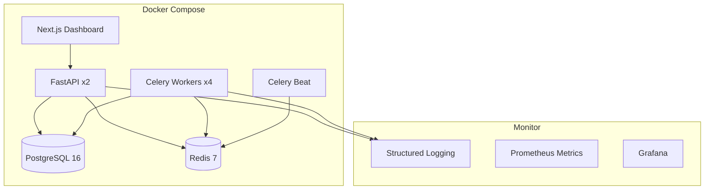

# ECADS-v3 Architecture

**Early Compounder & Fundamental Acceleration Discovery System**

Version: 3.0.0 | Indian Equity Markets (NSE / BSE / SME)

---

## 1. Executive Summary

ECADS-v3 is a **point-in-time, evidence-traceable, forensic-aware** research engine for Indian listed equities. It does **not** predict exact prices or guarantee multibaggers. It identifies companies where **fundamental improvement appears to be occurring faster than market expectations reflect**, with emphasis on the transition from **Early Business Change → Market Recognition**.

### Core Design Principles

| Principle | Implementation |
|-----------|----------------|
| Evidence-first | Every claim linked to source provenance |
| Point-in-time (PIT) | No lookahead; filing_timestamp governs availability |
| No hallucination | Missing data → `DATA NOT AVAILABLE` |
| Multi-dimensional scoring | Opportunity, Earliness, Risk, Confidence — never one number |
| Winners + Failures | Train and validate on both outcome classes |
| Sector-aware | Different KPIs, thresholds, valuation logic per sector |
| Reproducibility | Same inputs + decision timestamp → same outputs |

---

## 2. System Architecture (Logical Layers)



### Component Responsibilities

| Layer | Components | Purpose |
|-------|------------|---------|
| **Ingestion** | Celery workers, scrapers (permitted), API connectors | Fetch, parse, dedupe raw data |
| **Normalization** | Unit conversion, ticker mapping, C/A adjustment | Canonical schema |
| **PIT Engine** | Timestamp assignment, availability filtering | Prevent lookahead bias |
| **Feature Engines** | 15+ specialized engines | Domain-specific metrics |
| **Scoring** | Weighted composite + hard risk gates | Rank candidates |
| **ML** | Rule-based first, then LR/RF/XGB/LGBM | Probability estimates |
| **Backtesting** | Walk-forward, transaction costs, survivorship control | Validate hypotheses |
| **API/Dashboard** | REST + WebSocket, Plotly charts | Human consumption |

---

## 3. System Data Flow



### Batch Schedule

| Job | Frequency | Dependency |
|-----|-----------|------------|
| Price ingestion | End of day | Exchange close |
| Exchange announcements | Hourly (market hours) | NSE/BSE feeds |
| Financial results | Event-driven | Filing detection |
| Tender radar | Daily | Govt portal crawl |
| Feature computation | Daily 18:00 IST | All upstream fresh |
| Scoring | Daily 19:00 IST | Features complete |
| Backtest (offline) | Weekly | Historical snapshots |

---

## 4. Source Map

See [DATA_SOURCES.md](./DATA_SOURCES.md) for full source registry.

### Primary Connectors (Phase 2+)

| Source | Data Types | Access Method |
|--------|------------|---------------|
| NSE India | Announcements, results, shareholding | Official APIs / permitted downloads |
| BSE India | Same | Official APIs |
| SEBI | XBRL, regulatory actions | Public filings |
| Company IR sites | Presentations, transcripts | Structured crawl (robots-respecting) |
| CPPP / GeM / eProcurement | Tenders, awards | Public portal APIs / HTML |
| NSE/BSE price feeds | OHLCV, corporate actions | Licensed or permitted sources |

### Secondary (Discovery Only)

Screener, Trendlyne, Tijori, Moneycontrol — cross-check only; Tier 1 wins on conflict.

---

## 5. Source Priority Hierarchy

```
Tier 1 (Primary Official)     → AUTHORITATIVE for material facts
Tier 2 (Government)           → AUTHORITATIVE for tender/award facts
Tier 3 (Secondary Financial)  → DISCOVERY + CROSS-CHECK only
Model-derived                 → LABELED as MODEL ESTIMATE
Missing                       → DATA NOT AVAILABLE
Conflict                      → SOURCE CONFLICT (both retained)
```

**Resolution rule:** When Tier 1 and Tier 3 disagree, Tier 1 value used; conflict logged in `data_quality` table.

---

## 6. Point-in-Time Architecture

### Timestamp Fields (Mandatory on Every Record)

| Field | Definition |
|-------|------------|
| `period_end_date` | Financial period end (NOT availability proxy) |
| `filing_timestamp` | Exchange/regulatory filing datetime |
| `publication_timestamp` | Document publication if different |
| `information_available_at` | `max(filing_timestamp, publication_timestamp)` |
| `system_ingestion_timestamp` | When ECADS ingested |
| `historical_decision_timestamp` | Backtest/query cutoff |

### PIT Filter Rule

```python
usable_records = records.where(
    information_available_at <= historical_decision_timestamp
)
```

**Never** use `period_end_date` as a proxy for information availability.

### Example

- Period: 31-Dec-2025
- Filed: 14-Feb-2026 18:32 IST
- Decision date 31-Dec-2025 → **EXCLUDED**
- Decision date 15-Feb-2026 → **INCLUDED**

Implementation: `ecads/core/pit.py`

---

## 7. Database ER Design

See [DATABASE_ER.md](./DATABASE_ER.md) for full ER diagram and DDL.

### Entity Groups

1. **Master Data:** `companies`, `securities`, `source_registry`
2. **Market Data:** `prices`, `corporate_actions`
3. **Financials:** `financial_results`, `income_statement`, `balance_sheet`, `cash_flow`, `ratios`
4. **Ownership:** `shareholding`, `institutional_holdings`, `promoter_encumbrance`
5. **Documents:** `documents`, `document_extractions`, `management_guidance`
6. **Orders/Tenders:** `orders`, `tenders`, `tender_company_matches`, `tender_awards`
7. **Events:** `catalysts`, `events`, `governance_events`, `regulatory_events`
8. **Analytics:** `scores`, `score_history`, `risk_flags`, `model_predictions`
9. **Validation:** `backtests`, `data_quality`, `regulatory_versions`

All tables inherit provenance columns per §92.

---

## 8. Feature Dictionary

See [FEATURE_DICTIONARY.md](./FEATURE_DICTIONARY.md).

Key computed features:

| Feature | Engine | Range / Type |
|---------|--------|--------------|
| GAI (Growth Acceleration Index) | Fundamental | Standardized z-score |
| CFCR Score | Cash Flow | 0–100 (sector-benchmarked) |
| iROCE | Capital Efficiency | Ratio or `NOT STABLE` |
| Earliness Score | Scoring | 0–100 |
| Expectations Gap Score | Expectations | 0–100 |
| TENDER_RELEVANCE_SCORE | Tender | 0–100 |
| MANAGEMENT_CREDIBILITY_SCORE | Management | 0–100 |

---

## 9. Tender Architecture



### Tender Pipeline

1. **Ingest** from CPPP, GeM, state portals (robots-respecting)
2. **Normalize** to canonical tender schema
3. **NLP match** listed companies → `tender_company_matches` with `TENDER_RELEVANCE_SCORE`
4. **Materiality** → Tender Value / Revenue, / Market Cap, / Order Book
5. **State machine** tracking with provenance
6. **Safety language** — never "will win"; only "potentially relevant"

### Key Tables

`tenders`, `tender_documents`, `tender_bids`, `tender_awards`, `tender_company_matches`

---

## 10. Forensic Accounting Architecture



### Forensic Flags (Non-Binary)

- Receivables growth > revenue growth
- Inventory growth > revenue growth
- CFO lagging PAT (sector-adjusted)
- Parent-subsidiary divergence (investigate, not auto-fraud)
- Tax unexplained variance
- Auditor qualification / resignation

**Hard risk gates** block high-opportunity scores when serious flags present.

Implementation: `ecads/forensic_engine/`

---

## 11. Regulatory Version Architecture



### Versioned Rules Table

| Column | Purpose |
|--------|---------|
| `regulation_name` | e.g. "NSE SME Mainboard Migration" |
| `version` | Semantic version or notification number |
| `effective_date` | When rule applies |
| `superseded_date` | When replaced (NULL if current) |
| `applicable_rule` | JSON rule parameters |
| `source_url` | Official notification link |

**Never hard-code thresholds permanently.**

---

## 12. Scoring Architecture

### Four Primary Dimensions

| Score | Range | Higher = |
|-------|-------|----------|
| Opportunity | 0–100 | Better fundamental/catalyst profile |
| Earliness | 0–100 | Earlier in discovery cycle |
| Risk | 0–100 | Greater risk (inverted interpretation) |
| Confidence | 0–100 | Stronger evidence quality |

### Opportunity Sub-Weights (Configurable)

| Component | Default Weight |
|-----------|----------------|
| Fundamental acceleration | 15 |
| Revenue/EPS growth | 10 |
| Earnings quality | 8 |
| Margins/ROCE/ROIC | 8 |
| Cash flow/balance sheet | 8 |
| Business transformation | 8 |
| Order book/inflow | 6 |
| Tender catalyst | 5 |
| Management credibility | 5 |
| Market confirmation | 5 |
| Ownership confirmation | 3 |
| Valuation/expectations gap | 10 |
| Rerating potential | 5 |
| Sector opportunity | 4 |

### Hard Risk Gates

Mandatory investigation blocks when:

- Qualified audit
- Extreme promoter encumbrance
- Unexplained cash-flow divergence + supporting evidence
- Regulatory action (material)
- Severe dilution without justification

### Classification Output

`EARLY ACCELERATOR`, `FUNDAMENTAL BREAKOUT`, `WATCHLIST`, `VALUE TRAP`, etc.

### 2D Opportunity Matrix

- X: Earliness | Y: Opportunity
- Quadrants: Priority Research / Quality but Late / Watchlist / Ignore

---

## 13. Backtesting Architecture



### Mandatory Metrics

- Returns: 3M, 6M, 12M, 24M, 36M
- Risk-adjusted: Sharpe, Sortino, max drawdown
- Classification: win rate, false-positive rate, false-negative rate
- **Transaction costs:** brokerage, STT, GST, stamp duty, slippage
- **Survivorship control:** include delisted/suspended
- **Regime testing:** bull/bear/sideways, rate cycles
- **Sector-neutral validation**

### Walk-Forward Protocol

```
TRAIN (t-36m to t-12m) → VALIDATE (t-12m to t-6m) → TEST (t-6m to t)
Rolling windows. Never shuffle time-series.
```

---

## 14. ML Architecture

### Phase Order

1. **Rule-based engine** (production first)
2. Logistic Regression → Random Forest → XGBoost/LightGBM
3. Neural nets only if data volume justifies

### Targets

- P(12M excess return > 20%)
- P(12M excess return > 50%)
- P(24M excess return > 50% / > 100%)
- P(36M excess return > 100%)

### Explainability

- SHAP values per prediction
- Top positive / negative factors
- Calibration curves (Brier score, reliability diagram)

### Winner / Failure Databases

| DB | Labels |
|----|--------|
| Winners | 2x, 3x, 5x, 10x, 20x+ over meaningful periods |
| Failures | Value traps, failed turnarounds, accounting failures, etc. |

Both used in training and validation.

---

## 15. Dashboard Architecture

### Tech Stack

- **Backend:** FastAPI + WebSocket for live updates
- **Frontend:** React/Next.js + Plotly
- **Auth:** Role-based (researcher, admin)

### Dashboard Modules (§81)

| Module | Data Source |
|--------|-------------|
| Top Early Accelerators | `scores` + `score_history` |
| Score Movers | Δ score vs prior day |
| Fundamental Accelerators | GAI, margin, ROCE movers |
| Earnings Surprises | `earnings_surprises` |
| Tender Radar | `tenders` + matches |
| Order Book Radar | `orders` |
| SME → Mainboard Radar | `sme_eligibility` |
| Promoter Risk Radar | `promoter_encumbrance` |
| Governance Radar | `governance_events` |
| Valuation Radar | `valuations` percentile |
| Thesis Breakers | Invalidation conditions triggered |

### Daily Outputs

- **TOP 20 Early Compounder Candidates** (§78)
- **Tender Radar Output** (§79)
- **Catalyst Radar** (§80)

Every output includes disclaimer (§88).

---

## 16. Deployment Architecture



### Environment Tiers

| Tier | Purpose |
|------|---------|
| dev | Local docker-compose, sample data |
| staging | Full pipeline, historical backfill |
| prod | Daily batch + API + dashboard |

### Security

- Secrets via environment variables
- Rate limiting on API
- Audit log for score reproduction queries
- No bypass of CAPTCHA/paywall/auth boundaries (§94)

---

## 17. Research Evidence Graph

```
CLAIM → EVIDENCE → SOURCE → DATE → DOCUMENT → PAGE → CONFIDENCE
```

Stored in JSONB on research reports and queryable via API.

Example:
- Claim: "Capacity expanding"
- Evidence: Investor presentation p.12
- Source: NSE filing
- Confidence: HIGH

---

## 18. Failure Modes & Mitigations

| Failure | Mitigation |
|---------|------------|
| Stale data | `data_freshness_status` gates high-confidence output |
| Source conflict | Retain both; flag `SOURCE CONFLICT` |
| Lookahead bias | Strict PIT filtering in all engines |
| Overfitting | Walk-forward + regime + sector-neutral tests |
| Illiquid microcap slippage | Transaction-cost backtest + liquidity score |
| Tender hallucination | State machine + official award only |
| Universal CFCR threshold | Sector-benchmarked CFCR score (v3 fix) |

---

## 19. Technology Stack

Python 3.11+ | PostgreSQL 16 | Polars/Pandas | FastAPI | React/Next.js | scikit-learn | XGBoost | LightGBM | Redis | Celery | Docker | pytest

---

## 20. Disclaimer (Always Attached to Output)

> This is a quantitative research and screening system. Historical patterns do not guarantee future returns. Scores are model estimates based on available information and are not investment advice. Tender opportunities, management guidance and business catalysts may not convert into realized revenue or earnings.
