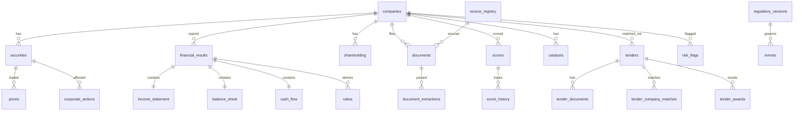

# ECADS-v3 Database ER Design

## Entity Relationship Diagram



---

## Core Tables

### companies

| Column | Type | Notes |
|--------|------|-------|
| company_id | UUID PK | |
| name | VARCHAR | Legal name |
| cin | VARCHAR | Corporate Identity Number |
| sector | VARCHAR | ECADS sector classification |
| industry | VARCHAR | |
| incorporation_date | DATE | |
| status | ENUM | ACTIVE, DELISTED, MERGED, SUSPENDED |
| created_at | TIMESTAMPTZ | |
| updated_at | TIMESTAMPTZ | |

### securities

| Column | Type | Notes |
|--------|------|-------|
| security_id | UUID PK | |
| company_id | UUID FK | |
| isin | VARCHAR UNIQUE | |
| nse_symbol | VARCHAR | |
| bse_scrip_code | VARCHAR | |
| exchange | ENUM | NSE, BSE, BOTH |
| segment | ENUM | MAINBOARD, SME |
| listing_date | DATE | |
| face_value | DECIMAL | |
| status | ENUM | ACTIVE, DELISTED, SUSPENDED |
| source | VARCHAR | |
| source_url | VARCHAR | |
| retrieved_at | TIMESTAMPTZ | |

### universe_membership

| Column | Type | Notes |
|--------|------|-------|
| security_id | UUID FK | |
| universe | ENUM | MAINBOARD, SME, MICROCAP, SMALLCAP, MIDCAP, LARGECAP, ILLIQUID, HIGH_LIQUIDITY |
| effective_from | DATE | |
| effective_to | DATE | NULL = current |
| market_cap | DECIMAL | At assignment |
| avg_daily_value | DECIMAL | Liquidity metric |

---

## Provenance Mixin (All Fact Tables)

Every table storing factual data includes:

```sql
source              VARCHAR NOT NULL,
source_type         VARCHAR NOT NULL,  -- TIER1_OFFICIAL, TIER2_GOVT, TIER3_SECONDARY, MODEL
source_url          VARCHAR,
document_id         UUID REFERENCES documents(document_id),
published_at        TIMESTAMPTZ,
filing_timestamp    TIMESTAMPTZ,
retrieved_at        TIMESTAMPTZ NOT NULL DEFAULT NOW(),
period              VARCHAR,           -- e.g. 'Q3FY26'
period_end          DATE,
information_available_at TIMESTAMPTZ NOT NULL,
value               DECIMAL,
unit                VARCHAR DEFAULT 'INR_CR',
data_status         VARCHAR DEFAULT 'ACTUAL',  -- ACTUAL, ESTIMATED, DERIVED, MISSING
confidence          VARCHAR DEFAULT 'HIGH'       -- HIGH, MEDIUM, LOW, UNVERIFIED
```

---

## Financial Tables

### financial_results (header)

Links to `income_statement`, `balance_sheet`, `cash_flow` with `report_type` (CONSOLIDATED | STANDALONE).

### Key ratio columns (ratios table)

- roe, roce, roic, incremental_roce
- cfcr_score, cfcr_warning
- effective_tax_rate, tax_reconciliation_status
- debt_to_equity, net_debt, working_capital

---

## Scoring Tables

### scores (current snapshot)

| Column | Type |
|--------|------|
| company_id | UUID FK |
| as_of_date | DATE |
| opportunity_score | SMALLINT 0-100 |
| earliness_score | SMALLINT 0-100 |
| risk_score | SMALLINT 0-100 |
| confidence_score | SMALLINT 0-100 |
| classification | VARCHAR |
| fundamental_score | SMALLINT |
| growth_score | SMALLINT |
| catalyst_score | SMALLINT |
| market_score | SMALLINT |
| valuation_score | SMALLINT |
| primary_catalyst | TEXT |
| primary_risk | TEXT |
| thesis_invalidation | JSONB |
| evidence_quality | VARCHAR |
| model_version | VARCHAR |
| historical_decision_timestamp | TIMESTAMPTZ |

### score_history

Same columns + `recorded_at` for velocity/acceleration tracking.

---

## Tender Tables

### tenders

| Column | Type |
|--------|------|
| tender_id | UUID PK |
| external_tender_id | VARCHAR |
| issuer | VARCHAR |
| description | TEXT |
| tender_value | DECIMAL |
| currency | VARCHAR DEFAULT 'INR' |
| stage | ENUM (16 states) |
| closing_date | DATE |
| award_status | VARCHAR |
| source | VARCHAR |
| source_url | VARCHAR |
| confidence | VARCHAR |

### tender_company_matches

| Column | Type |
|--------|------|
| tender_id | UUID FK |
| company_id | UUID FK |
| relevance_score | SMALLINT 0-100 |
| match_reason | JSONB |
| materiality_revenue_pct | DECIMAL |
| materiality_mcap_pct | DECIMAL |
| bid_risk | VARCHAR |
| bg_stress_factor | DECIMAL NULL |

---

## Indexes (Critical for PIT Queries)

```sql
CREATE INDEX idx_financials_pit ON financial_results (security_id, information_available_at);
CREATE INDEX idx_scores_as_of ON scores (as_of_date, opportunity_score DESC);
CREATE INDEX idx_prices_security_date ON prices (security_id, trade_date);
CREATE INDEX idx_tenders_stage ON tenders (stage, closing_date);
CREATE INDEX idx_catalysts_upcoming ON catalysts (expected_date, status);
```

---

## Full DDL

See `ecads/db/schema.sql` for executable schema.
